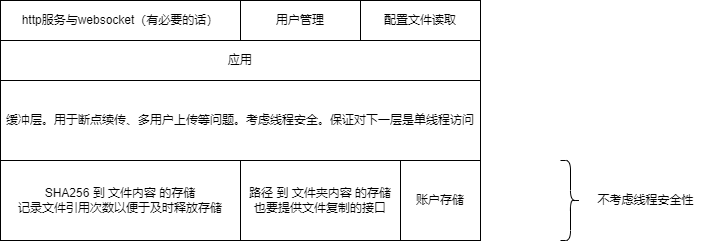

# cloud_disk

一个纯c++网盘实现

## 代码风格约定

- 宏定义、常量 使用 大蛇式命名
- 类型名（类、结构体、typedefine） 使用 大驼峰命名
- 方法、函数 使用 小驼峰命名
- 局部变量 使用 小蛇式命名

**不要全局变量**

**头文件里不准 using namespace**

其它随意。这里贴出 vscode 中 拓展 `C_Cpp.clang_format_fallbackStyle` 的设置，建议统一用这个，不强制。

```
{ BasedOnStyle: LLVM, UseTab: Always, IndentWidth: 4, TabWidth: 4, AccessModifierOffset: -4}
```

## 模块分割设计



## 数据库设计（部分

### 用户目录存储

以下两张表描述一个文件数

- 文件夹表
	- 自己的文件夹id
	- 所属目录的文件夹id
	- 所处路径
	- 文件夹名
- 文件表
	- 所属目录的文件夹id
	- 所处路径
	- 文件名
	- 文件哈希值
- 文件索引数量表
  - 文件哈希值
  - 文件索引数量

以上设计不太符合数据库设计范式，而且也会产生二义性。
但是写起来会方便一点，效率大概会高一点，减少查询次数。
毕竟只是课设，

在创建新用户是在根目录下创建文件夹，文件夹名为用户表中该用户id，该目录下文件树即为用户文件树。