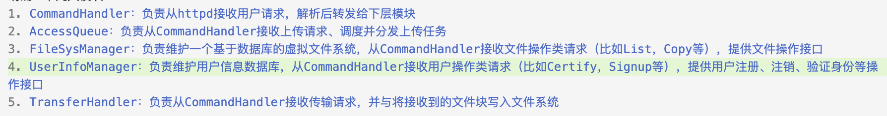

# cloud_disk

一个纯c++网盘实现

## 代码风格约定

- 宏定义、常量 使用 大蛇式命名
- 类型名（类、结构体、typedefine） 使用 大驼峰命名
- 方法、函数 使用 小驼峰命名
- 局部变量 使用 小蛇式命名

**不要全局变量**，但如果加上 `static` 修饰符，可以接受。

**头文件里不准 using namespace**

其它随意。这里贴出 vscode 中 拓展 `C_Cpp.clang_format_fallbackStyle` 的设置，建议统一用这个，不强制。

```
{ BasedOnStyle: LLVM, UseTab: Always, IndentWidth: 4, TabWidth: 4, AccessModifierOffset: -4}
```

## 模块分割设计

