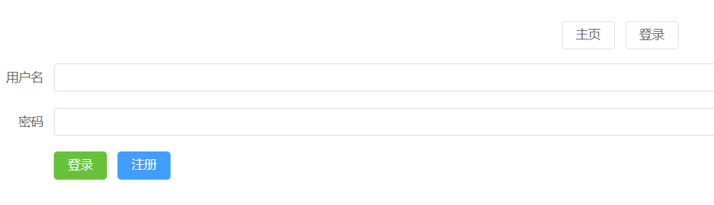
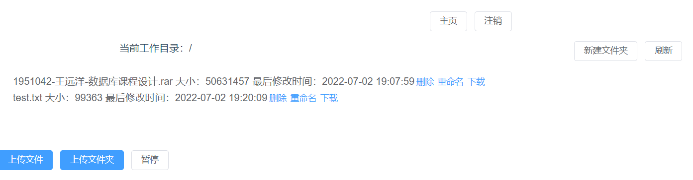
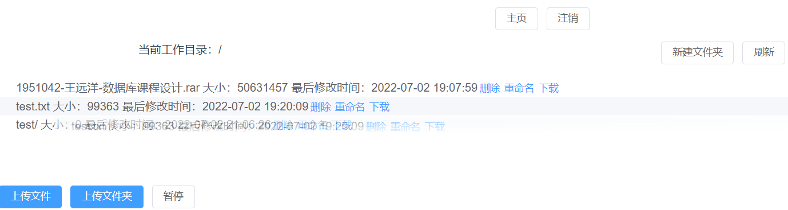

# 使用手册

## client端

因为web端和client桌面端基于一套框架开发，所以UI类似，各种界面操作也一致。下面对client端的操作简述：

### client桌面端

#### 登录注册界面
登录注册界面如下所示：

点击相应的按钮即可以进行操作，密码有一定的强度要求，同时可以处理逻辑上的错误，比如注册存在的用户，登录不存在的用户等。

#### 网盘首页以及主要操作
网盘首页如下：

可以显式看到相关的操作，包括上传文件（夹），以及删除、重命名、下载、新建文件夹等。

#### 移动文件操作
移动文件的操作通过鼠标拖动完成，如下所示：

上面演示的是将`test.txt`文件拖动到`test`文件夹下面，其余情形类似。

### web端

web端的操作与客户端相似，关于web端的配置可以在安装手册中查看，**注意配置时设置服务器的地址**。

## server端

server端编译运行，按照安装手册编译，运行程序即可。在`source/include/utility.hpp`中有关于数据库的配置，用户名和密码默认为root和root123，可以按需设置。

